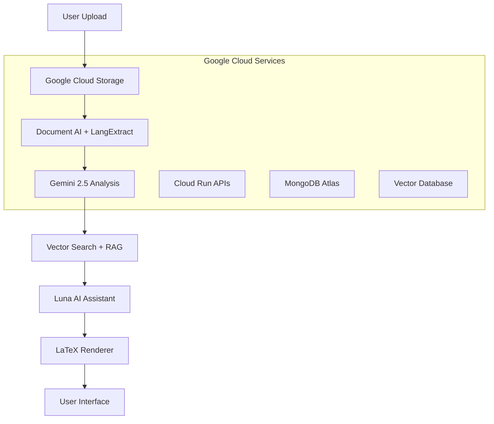

# Legal Clarity 🏛️⚖️

> **AI-Powered Legal Document Analysis for India**  
> *Transforming complex legal jargon into clear, actionable insights using Google Cloud AI*

[![Google GenAI Exchange 2025](https://img.shields.io/badge/Google_GenAI_Exchange-2025-4285F4?style=for-the-badge&logo5](https://img.shields.io/badge/Powered_by-Gemini_2.5-FF6B6B?style=for-the-badge&logo=google Cloud](https://img.shields.io/badge/Deployed_on-Google_Cloud-4ense: MIT](https://img.shieldsBridging India's Justice Gap**

**Legal Clarity** addresses India's **50.2 million pending court cases** by democratizing legal document understanding. Our platform transforms information asymmetry into empowerment, helping everyday Indians navigate rental agreements, loan contracts, and terms of service with confidence.

### ✨ **Key Highlights**
- 🎯 **LaTeX-Enhanced Document Viewer** - Professional mathematical notation rendering
- 🤖 **Luna AI Assistant** - Powered by Gemini 2.5 for contextual legal explanations  
- 📊 **Predictive Analytics** - Win/loss probability assessments for legal scenarios
- 🗣️ **Voice Commands** - Hands-free document analysis in multiple Indian languages
- ⚡ **Real-time Processing** - Sub-2-second response times via Google Cloud Run
- 🇮🇳 **Indian Legal Context** - Trained specifically on Indian legal frameworks

***

## 📋 **Table of Contents**
- [🚀 Getting Started](#-getting-started)
- [🏗️ Architecture](#️-architecture) 
- [🌟 Features](#-features)
- [🛠️ Technology Stack](#️-technology-stack)
- [⚙️ Installation](#️-installation)
- [📖 Usage](#-usage)
- [🤝 API Documentation](#-api-documentation)
- [🎯 Roadmap](#-roadmap)
- [👥 Contributing](#-contributing)
- [📄 License](#-license)

***

## 🚀 **Getting Started**

Legal Clarity leverages **Google Cloud's AI ecosystem** to transform complex legal documents into accessible insights for **1.4 billion Indians**.

### **Problem We're Solving**
- **Information Asymmetry**: 87.6% of Indians lack legal literacy to understand contracts
- **Financial Risk**: Unfavorable terms in documents lead to significant monetary losses  
- **Access Barriers**: Limited legal consultation availability for common citizens
- **Language Barriers**: Legal documents primarily in English with complex terminology

### **Our Solution**
A comprehensive web platform that combines **LaTeX document rendering**, **AI-powered analysis**, and **predictive legal insights** tailored for Indian legal frameworks.

***

## 🏗️ **Architecture**



### **Core Components**

| Component | Technology | Purpose |
|-----------|-----------|---------|
| **Frontend** | React + LaTeX.js | Professional document rendering |
| **AI Analysis** | Gemini 2.5 Pro/Flash | Multi-modal document understanding |
| **Document Processing** | Document AI + LangExtract | OCR and structured data extraction |
| **Knowledge Base** | Vector Search + RAG | Legal precedent matching |
| **Database** | MongoDB Atlas on GCP | Document metadata and user data |
| **Deployment** | Cloud Run + Cloud Functions | Auto-scaling microservices |

***

## 🌟 **Features**

### **🔍 Advanced Document Analysis**
- **Multi-format Support**: PDF, DOCX, scanned documents via Google Document AI
- **LaTeX Rendering**: Professional mathematical and legal notation display
- **Smart Highlighting**: AI-driven identification of critical clauses
- **Structure Recognition**: Automatic section detection and navigation

### **🤖 Luna AI Assistant**
- **Contextual Q&A**: Document-specific responses with legal citations
- **Voice Integration**: Speech-to-text for hands-free analysis
- **Multi-language**: Hindi and regional Indian language support
- **Comparative Analysis**: Cross-document insights and recommendations

### **📊 Predictive Analytics Dashboard**  
- **Win/Loss Assessment**: Probability analysis based on similar case outcomes
- **Risk Scoring**: Color-coded severity indicators for each clause
- **Financial Impact**: Interactive charts for loans, EMI calculations
- **Compliance Checking**: Indian regulatory framework validation

### **🎯 Interactive Features**
- **Timeline Navigation**: Clause-by-clause document exploration
- **Annotation System**: LaTeX-compatible note-taking
- **Export Options**: PDF, Word, PowerPoint summary generation
- **Real-time Collaboration**: Team-based document review

***

## 🛠️ **Technology Stack**

### **Google Cloud AI Services**
```yaml
Gemini API: Multi-modal document understanding (up to 1000 pages)
Document AI: Advanced OCR and form processing  
LangExtract: Structured legal data extraction
Vertex AI: ML embeddings and model hosting
Translate API: Multi-language support
Cloud Natural Language: Entity recognition
```

### **Infrastructure & Deployment**
```yaml
Cloud Run: Serverless API hosting with auto-scaling
Cloud Functions: Event-driven document processing
Cloud Storage: Secure document storage with CDN
MongoDB Atlas: Primary application database on GCP
Vector Search: Legal precedent embeddings
Cloud Load Balancer: High-availability traffic distribution
```

### **Frontend & Experience**
```yaml
React/Vue.js: Modern responsive web application
LaTeX.js: Mathematical notation rendering
Progressive Web App: Mobile-optimized experience
WebRTC: Real-time voice processing
```

***

## ⚙️ **Installation**

### **Prerequisites**
- Node.js 18+ and npm
- Google Cloud account with GenAI APIs enabled
- MongoDB Atlas cluster configured
- Git for version control

### **Local Development Setup**

1. **Clone the Repository**
```bash
git clone https://github.com/your-org/legal-clarity.git
cd legal-clarity
```

2. **Install Dependencies**
```bash
# Backend dependencies
cd server
npm install

# Frontend dependencies  
cd ../client
npm install
```

3. **Environment Configuration**
```bash
# Create environment file
cp .env.example .env

# Configure your environment variables
GOOGLE_CLOUD_PROJECT_ID=your-project-id
GEMINI_API_KEY=your-gemini-key
MONGODB_ATLAS_URI=your-mongodb-connection
DOCUMENT_AI_LOCATION=us
VECTOR_SEARCH_ENDPOINT=your-vector-endpoint
```

4. **Database Setup**
```bash
# Initialize MongoDB collections
node server/scripts/initDatabase.js

# Seed legal framework data
node server/scripts/seedLegalData.js
```

5. **Start Development Servers**
```bash
# Start backend (Port 8080)
cd server
npm run dev

# Start frontend (Port 3000)
cd client
npm start
```

### **Production Deployment**

```bash
# Deploy to Google Cloud Run
gcloud run deploy legal-clarity-api \
  --source ./server \
  --platform managed \
  --region us-central1 \
  --allow-unauthenticated

# Deploy frontend
gcloud run deploy legal-clarity-web \
  --source ./client \
  --platform managed \
  --region us-central1 \
  --allow-unauthenticated
```

***

## 📖 **Usage**

### **Document Upload & Analysis**

1. **Upload Document**: Drag and drop PDF/DOCX files or use the upload button
2. **Processing**: Google Document AI extracts text and structure
3. **AI Analysis**: Gemini 2.5 provides contextual legal insights
4. **Interactive Review**: Navigate using timeline slider and severity indicators

### **Luna AI Interaction**

```javascript
// Example: Query Luna about a specific clause
const response = await fetch('/api/v1/luna/query', {
  method: 'POST',
  headers: { 'Content-Type': 'application/json' },
  body: JSON.stringify({
    documentId: 'doc_123',
    query: 'Explain the termination clause',
    selectedText: 'Either party may terminate...'
  })
});
```

### **Voice Commands**
- **"Analyze this document"** - Start comprehensive analysis
- **"Explain clause 5"** - Get detailed clause explanation  
- **"What are the risks?"** - Identify high-risk elements
- **"Show similar cases"** - Display legal precedents

***

## 🤝 **API Documentation**

### **Document Analysis API**

**POST** `/api/v1/analyze`
```json
{
  "documentId": "string",
  "analysisType": "comprehensive|quick|risk-only",
  "language": "en|hi|regional"
}
```

**Response:**
```json
{
  "documentId": "doc_123",
  "analysis": {
    "keyTerms": ["termination", "liability", "jurisdiction"],
    "riskFactors": [{
      "clause": "Section 5",
      "risk": "high", 
      "description": "Unfavorable termination terms"
    }],
    "complianceStatus": "compliant",
    "recommendations": ["Review termination notice period"]
  }
}
```

### **Luna AI Chat API**

**POST** `/api/v1/luna/chat`
```json
{
  "message": "What does this rental agreement say about security deposit?",
  "documentContext": "doc_123",
  "conversationId": "conv_456"
}
```

### **Predictive Analytics API**

**POST** `/api/v1/predict`
```json
{
  "documentType": "rental|loan|tos",
  "documentFeatures": {...},
  "jurisdiction": "maharashtra|delhi|karnataka"
}
```

### **Code of Conduct**
Please read our [Code of Conduct](CODE_OF_CONDUCT.md) to understand our community standards.


## 🙏 **Acknowledgments**

- **Google Cloud AI** team for Gemini API and infrastructure support
- **Indian Legal Community** for framework validation and expertise
- **Open Source Contributors** who made this project possible
- **Beta Users** providing invaluable feedback and testing

***

<div align="center">

### **Making Legal Knowledge Accessible to Every Indian** 🇮🇳

*Built with ❤️ for the Google GenAI Exchange 2025*

[⬆ Back to Top](#legal-clarity-️)

</div>

***
